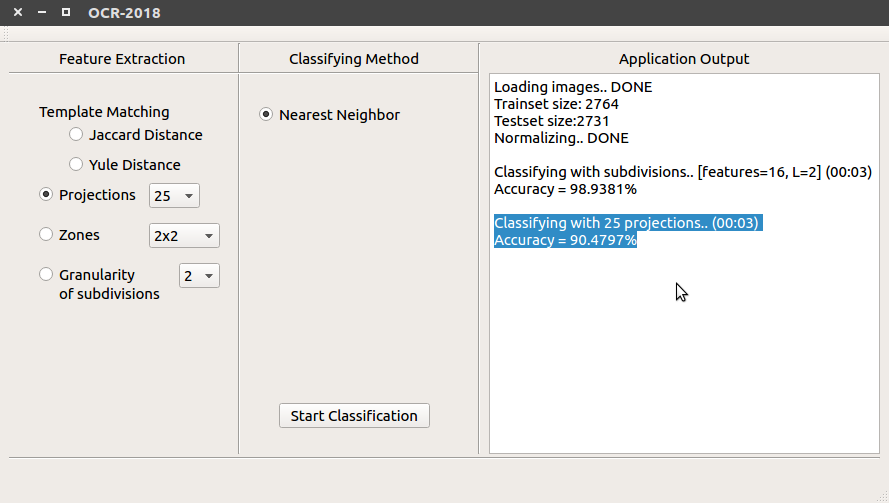
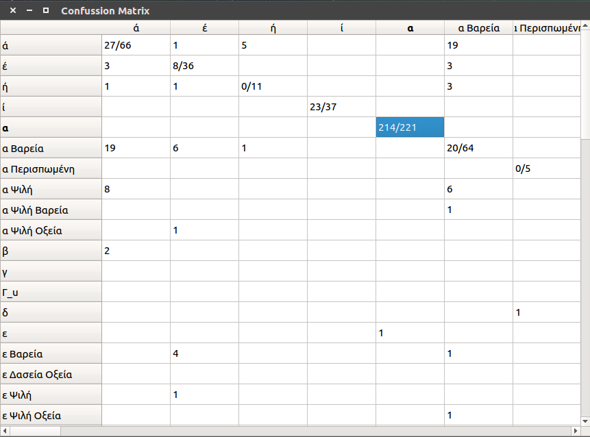

A Qt widget application to classify Greek polytonic characters.

Created with Qt Creator 4.7.1 based on Qt 5.11.2 (you can download Qt [here](http://download.qt.io/official_releases/qt/)).

**Screenshots**

